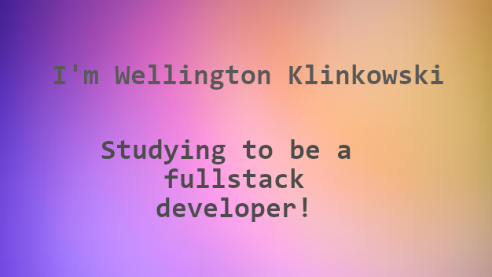

## About me
Me chamo Wellington Klinkowski, tenho 24 anos, sou de Blumenau-SC.   
Um apaixonado por hardware que monta e desmonta desktop desde de pequeno e que está se aventurando no mundo do software desde 2019.
Conclui o curso de desenvolvimento em Java, Spring, Angular e PostgreSQL do ENTRA21 da Blusoft.
Estágiei na Senior Sistenas por alguns meses e após isso consegui uma vaga na Edusoft como densevolvedor de sistemas.

# Technologies

